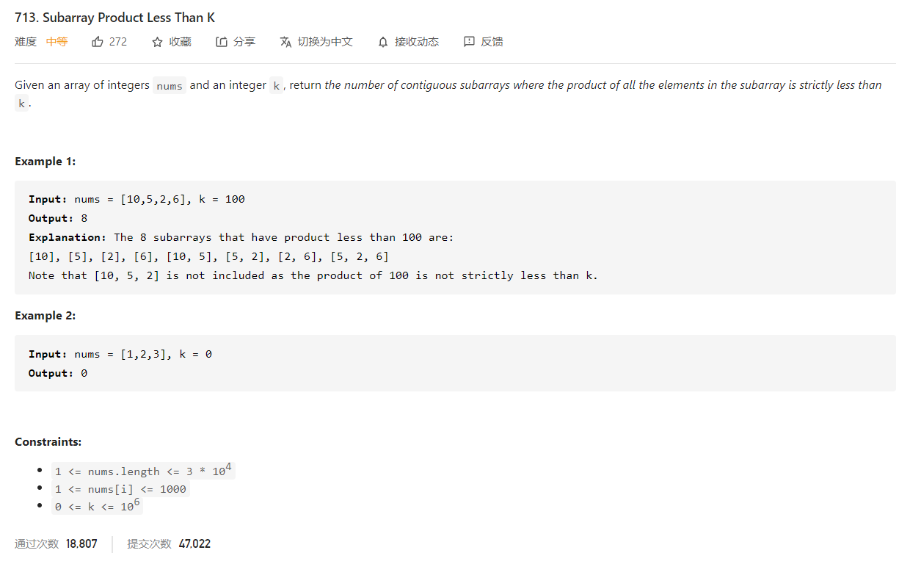

# LeetCode 713 Subarray Product Less Than K

[toc]



## 1. 取对数 + 二分查找

首先连乘的乘积肯定会超过`Integer`的数值范围（在最坏情况下会达到 $1000^{50000}$​​​​​​​​​​），导致数值溢出，这时候可以使用**取对数**的方法，既能限制数值范围，也不会改变数值的大小顺序。取对数后，乘法运算变成了加法运算，$\mathrm{log}(\Pi_i \ nums[i])=\sum_i \mathrm{log}\ nums[i]$​​​。

### 1.1 算法设计思路

对数组`nums`中的每个数取对数后，存储它的前缀和`prefix`，即$\mathrm{prefix}[i+1] = \sum_{x=0}^{i}log(nums[x])$ ，这样在二分查找时，对于`i`和`j`，我们可以用$\mathrm{prefix}[j+1]-\mathrm{prefix}[i]$得到 $\mathrm{nums}[i]$ 到 $\mathrm{nums}[j]$（包含$\mathrm{nums}[i]$与$\mathrm{nums}[j]$） 的连乘积的对数。对于固定的`i`当找到最大的满足条件的`j`后，它会包含 $j−i+1$个乘积小于 $k$ 的连续子数组。

**注释**

`right-left+1`的切入点是思维要放在区间的右端往左边方向延伸，例如区间`[1, 2, 3, 4]`满足要求，固定住`right(4)`的点，可选区间有`[4]、[4, 3]、[4, 3, 2]、[4, 3, 2, 1]`总共4个，也就是`right-left+1`。而`right`是保证递增的，此时`[1, 2, 3]`的区间已经处理完（`[3]、[3, 2]、[3、2、1]`）。如果从`left`为切入点，就会有`[1, 2, 3, 4]`和`[1, 2, 3]`的子数组中都包含有`[1]`，这里就会产生重复。

```java
class Solution {
    public int numSubarrayProductLessThanK(int[] nums, int k) {
        if (k == 0)
            return 0;
        double logk = Math.log(k);
        double[] prefix = new double[nums.length + 1];
        for (int i = 0; i < nums.length; i++) {
            prefix[i + 1] = prefix[i] + Math.log(nums[i]);
        }

        int ans = 0;
        for (int i = 0; i < prefix.length; i++) {
            int lo = i + 1, hi = prefix.length;
            while (lo < hi) {
                //二分法 查找满足prefix[j + 1] - prefix[i]小于logK的最大j
                int mi = lo + (hi - lo) / 2;
                if (prefix[mi] < prefix[i] + logk - 1e-9)
                    lo = mi + 1;
                else
                    hi = mi;
            }
            ans += lo - i - 1;
        }
        return ans;
    }
}
```

### 1.2 复杂度分析

时间复杂度：$O(nlog\ n)$，其中$n$是`nums`数组的长度。由于二分查找的时间复杂度为 $O(log_2\ n)$，需要进行$n$次，因此总的时间复杂度为 $O(nlog\ n)$。
空间复杂度：$O(n)$，用来存储前缀和数组$\mathrm{prefix}$。


## 2. 双指针

对于每个 $\mathrm{right}$，我们需要找到最小的 $\mathrm{left}$，满足 $\Pi_{i=left}^{right}nums[i]<k$ 。由于 $\mathrm{left}$ 向右滑动时，这个乘积是单调非增的，因此我们可以使用双指针的方法，单向地移动 $\mathrm{left}$。

### 2.1 算法设计思路

我们使用一重循环枚举，同时设置 $\mathrm{left}$ 的初始值为 $0$。在循环的每一步中，表示 $\mathrm{right}$ 向右移动了一位，将乘积乘以 $\mathrm{nums}[right]$。此时我们需要向右移动$\mathrm{}$，直到满足乘积小于$k$ 的条件。在每次移动时，需要将乘积除以 $\mathrm{nums}[left]$。当 $\mathrm{left}$ 移动完成后，对于当前的 $\mathrm{right}$，就包含了 $\mathrm{right} - \mathrm{left} + 1$ 个乘积小于 $k$ 的连续子数组。

**Java**

```java
class LeetCode_713_SubarrayProductLessThanK_Solution2 {
    public int numSubarrayProductLessThanK(int[] nums, int k) {
        if (k <= 1)
            return 0;
        int prod = 1, ans = 0, left = 0;
        for (int right = 0; right < nums.length; right++) {
            prod *= nums[right];
            while (prod >= k)
                prod /= nums[left++];
            ans += right - left + 1;
        }
        return ans;
    }
}
```

**Python**

```python
class Solution(object):
    def numSubarrayProductLessThanK(self, nums, k):
        if k <= 1: return 0
        prod = 1
        ans = left = 0
        for right, val in enumerate(nums):
            prod *= val
            while prod >= k:
                prod /= nums[left]
                left += 1
            ans += right - left + 1
        return ans
```

### 2.2 复杂度分析

* 时间复杂度：$O(n)$，其中 $n$ 是 $\mathrm{nums}$ 数组的长度。循环的时间复杂度为 $O(n)$，而 $\mathrm{left}$ 最多移动 $n$ 次，因此总的时间复杂度为 $O(n)$。
* 空间复杂度：$O(1)$。

