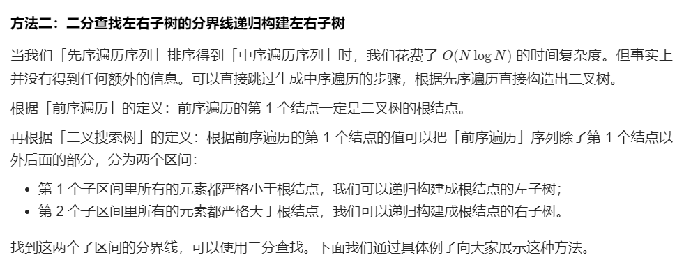
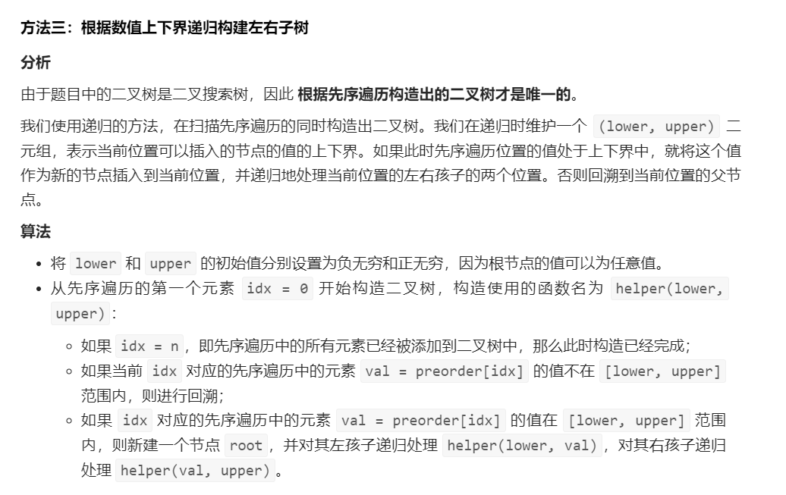
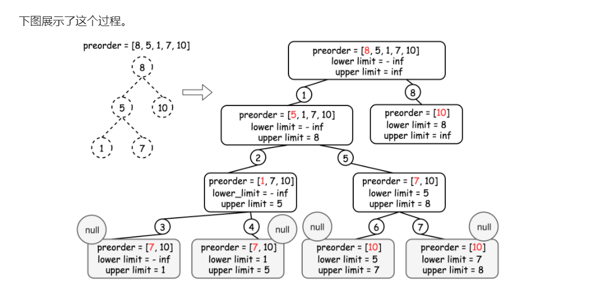
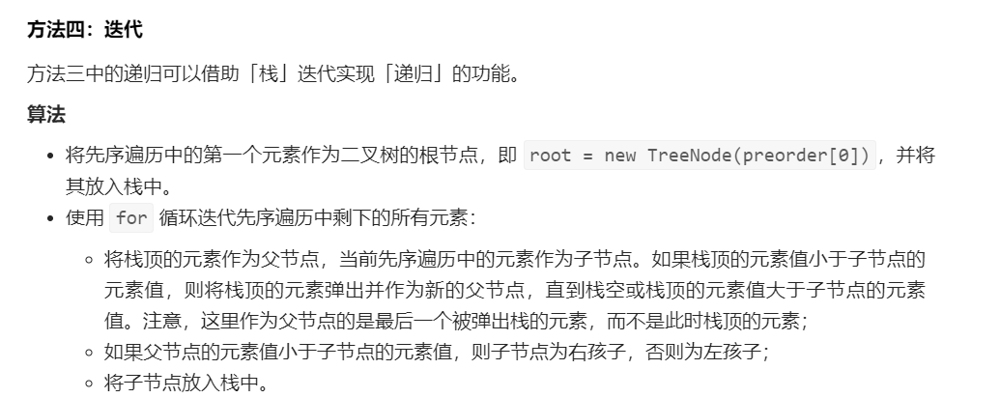

#  LeetCode 1008 前序遍历构造二叉树

## 

[toc]

## Construct Binary Search Tree from PreOrder Traversal

链接：https://leetcode-cn.com/problems/construct-binary-search-tree-from-preorder-traversal/


```java
/**
 * Definition for a binary tree node.
 * public class TreeNode {
 *     int val;
 *     TreeNode left;
 *     TreeNode right;
 *     TreeNode() {}
 *     TreeNode(int val) { this.val = val; }
 *     TreeNode(int val, TreeNode left, TreeNode right) {
 *         this.val = val;
 *         this.left = left;
 *         this.right = right;
 *     }
 * }
 */
class Solution {
    public TreeNode bstFromPreorder(int[] preorder) {
        int length = preorder.length;
        if(length == 0) return null;
        //前序遍历，第一个数就是根节点
        TreeNode root= new TreeNode(preorder[0]);
        TreeNode iNode;
        TreeNode parentNode = root;
        for(int index = 1; index < length; index++) {
            //从第2个数开始
            iNode = new TreeNode(preorder[index]);
            insertNode(parentNode, iNode);
        }
        return root;
    }

    //写一个节点插入函数
    private void insertNode(TreeNode root, TreeNode iNode) {
        if(iNode.val < root.val) {
            if (root.left == null) {
                root.left = iNode;
            }
            else insertNode(root.left, iNode);
    }
        else if(iNode.val > root.val) { 
            //插入节点值大于根节点值
            if(root.right == null) {
                //右节点为空
                root.right = iNode;
            }
            else {
                //右节点不为空
               insertNode(root.right, iNode);
            }
        }
    }
}
```

### 官方题解


```java
import java.util.Arrays;
import java.util.HashMap;
import java.util.Map;

public class Solution {
    public TreeNode bstFromPreorder(int[] preorder) {
        int len = preorder.length;
        Map<Integer, Integer> hashMap = new HashMap<>();

        int[] inorder = new int[len];
        System.arraycopy(preorder, 0, inorder, 0, len);
        Arrays.sort(inorder);

        int index = 0;
        for (Integer value : inorder) {
            hashMap.put(value, index);
            index++;
        }
        return dfs(0, len - 1, 0, len - 1, preorder, hashMap);
    }

    public TreeNode dfs(int preLeft, int preRight, int inLeft, int inRight, int[] preorder, Map<Integer, Integer> hashMap) {
        if (preLeft > preRight || inLeft > inRight) {
            return null;
        }
        int pivot = preorder[preLeft];
        TreeNode root = new TreeNode(pivot);
        int pivotIndex = hashMap.get(pivot);
        root.left = dfs(preLeft + 1, pivotIndex - inLeft + preLeft,
                inLeft, pivotIndex - 1, preorder, hashMap);
        root.right = dfs(pivotIndex - inLeft + preLeft + 1, preRight,
                pivotIndex + 1, inRight, preorder, hashMap);
        return root;
    }
}
```




```java
public class Solution {

    public TreeNode bstFromPreorder(int[] preorder) {
        int len = preorder.length;
        if (len == 0) {
            return null;
        }
        return dfs(preorder, 0, len - 1);
    }

    /**
     * 根据 preorder 的子区间 [left..right] 构建二叉树
     *
     * @param preorder
     * @param left
     * @param right
     * @return
     */
    private TreeNode dfs(int[] preorder, int left, int right) {
        if (left > right) {
            return null;
        }

        TreeNode root = new TreeNode(preorder[left]);
        if (left == right) {
            return root;
        }

        // 在区间 [left..right] 里找最后一个小于 preorder[left] 的下标
        // 注意这里设置区间的左边界为 left ，不能是 left + 1
        // 这是因为考虑到区间只有 2 个元素 [left, right] 的情况，第 1 个部分为空区间，第 2 部分只有一个元素 right
        int l = left;
        int r = right;

        while (l < r) {
            int mid = l + (r - l + 1) / 2;
            if (preorder[mid] < preorder[left]) {
                // 下一轮搜索区间是 [mid, r]
                l = mid;
            } else {
                // 下一轮搜索区间是 [l, mid - 1]
                r = mid - 1;
            }
        }
        
        TreeNode leftTree = dfs(preorder, left + 1, l);
        TreeNode rightTree = dfs(preorder, l + 1, right);
        root.left = leftTree;
        root.right = rightTree;
        return root;
    }
}
```






```java
public class Solution {

    private int index = 0;
    private int[] preorder;
    private int len;

    /**
     * 深度优先遍历，遍历的时候把左右边界的值传下去
     *
     * @param preorder
     * @return
     */
    public TreeNode bstFromPreorder(int[] preorder) {
        this.preorder = preorder;
        this.len = preorder.length;
        return dfs(Integer.MIN_VALUE, Integer.MAX_VALUE);
    }

    /**
     * 通过下限和上限来控制指针移动的范围
     *
     * @param lowerBound
     * @param upperBound
     * @return
     */
    private TreeNode dfs(int lowerBound, int upperBound) {
        // 所有的元素都已经添加到了二叉树中
        if (index == len) {
            return null;
        }

        int cur = preorder[index];
        if (cur < lowerBound || cur > upperBound) {
            return null;
        }

        index++;
        TreeNode root = new TreeNode(cur);
        root.left = dfs(lowerBound, cur);
        root.right = dfs(cur, upperBound);
        return root;
    }
}
```




```java
import java.util.ArrayDeque;
import java.util.Deque;

public class Solution {

    public TreeNode bstFromPreorder(int[] preorder) {
        int len = preorder.length;
        if (len == 0) {
            return null;
        }
        TreeNode root = new TreeNode(preorder[0]);
        Deque<TreeNode> stack = new ArrayDeque<>();
        stack.push(root);

        for (int i = 1; i < len; i++) {
            // 将栈的最后一个元素作为父元素，并从下一个前序遍历的节点创建子节点
            TreeNode node = stack.peekLast();
            TreeNode currentNode = new TreeNode(preorder[i]);
            
            // 栈中小于当前节点值的元素全部出栈，当前节点连接到最后一个弹出栈的结点的右边
            while (!stack.isEmpty() && stack.peekLast().val < currentNode.val) {
                node = stack.removeLast();
            }
            
            if (node.val < currentNode.val) {
                node.right = currentNode;
            } else {
                node.left = currentNode;
            }
            stack.addLast(currentNode);
        }
        return root;
    }
}
```


