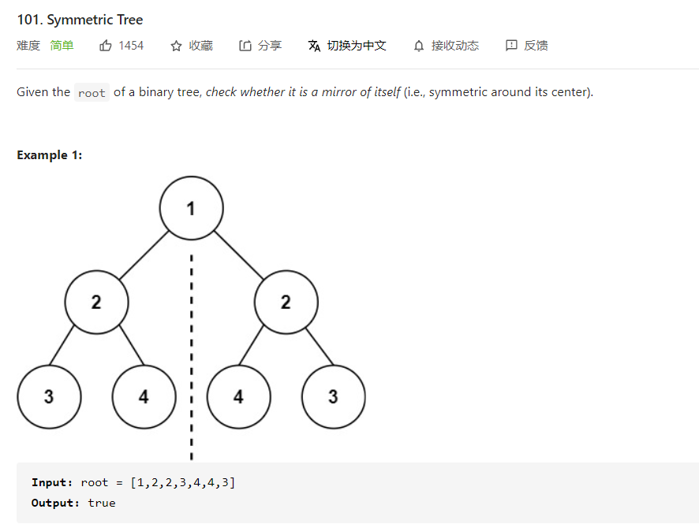
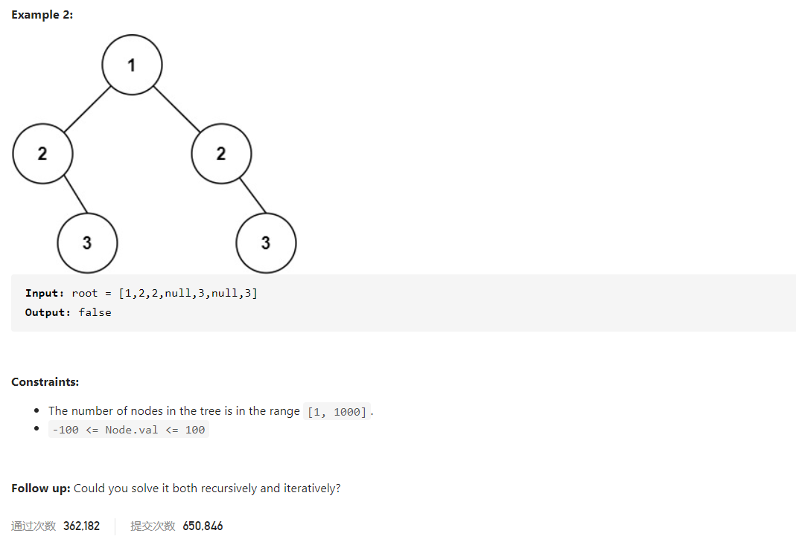
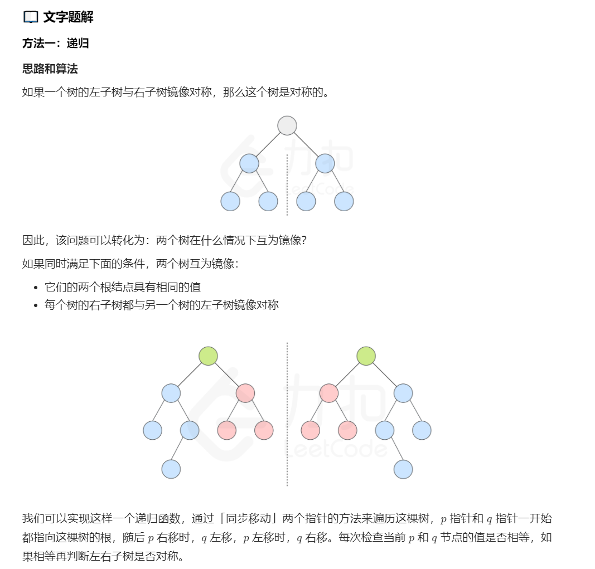
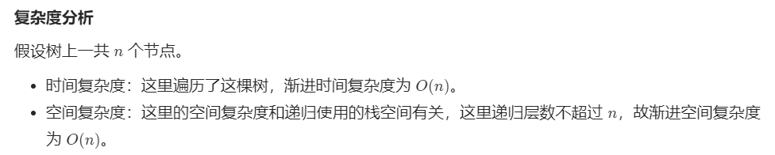
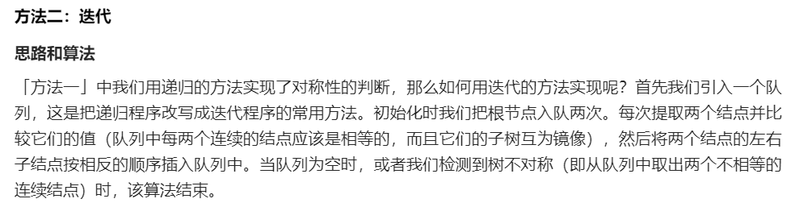

# LeetCode 101

[toc]








```java
class Solution {
    public boolean isSymmetric(TreeNode root) {
        return check(root, root);
    }

    public boolean check(TreeNode p, TreeNode q) {
        if (p == null && q == null) {
            return true;
        }
        if (p == null || q == null) {
            return false;
        }
        return p.val == q.val && check(p.left, q.right) && check(p.right, q.left);
    }
}
```

```c++
class Solution {
public:
    bool check(TreeNode *p, TreeNode *q) {
        if (!p && !q) return true;
        if (!p || !q) return false;
        return p->val == q->val && check(p->left, q->right) && check(p->right, q->left);
    }

    bool isSymmetric(TreeNode* root) {
        return check(root, root);
    }
};
```





```c++
class Solution {
public:
    bool check(TreeNode *u, TreeNode *v) {
        queue <TreeNode*> q;
        q.push(u); q.push(v);
        while (!q.empty()) {
            u = q.front(); q.pop();
            v = q.front(); q.pop();
            if (!u && !v) continue;
            if ((!u || !v) || (u->val != v->val)) return false;

            q.push(u->left); 
            q.push(v->right);

            q.push(u->right); 
            q.push(v->left);
        }
        return true;
    }

    bool isSymmetric(TreeNode* root) {
        return check(root, root);
    }
};
```

```java
class Solution {
    public boolean isSymmetric(TreeNode root) {
        return check(root, root);
    }

    public boolean check(TreeNode u, TreeNode v) {
        Queue<TreeNode> q = new LinkedList<TreeNode>();
        q.offer(u);
        q.offer(v);
        while (!q.isEmpty()) {
            u = q.poll();
            v = q.poll();
            if (u == null && v == null) {
                continue;
            }
            if ((u == null || v == null) || (u.val != v.val)) {
                return false;
            }

            q.offer(u.left);
            q.offer(v.right);

            q.offer(u.right);
            q.offer(v.left);
        }
        return true;
    }
}
```

