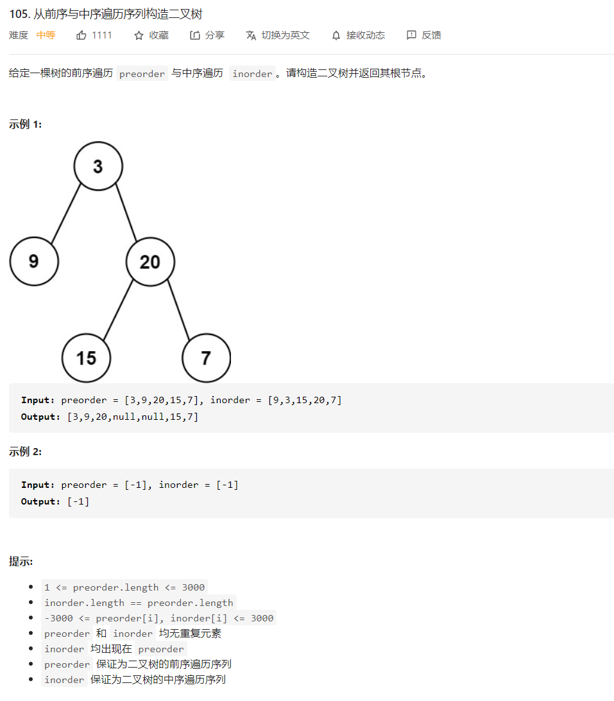
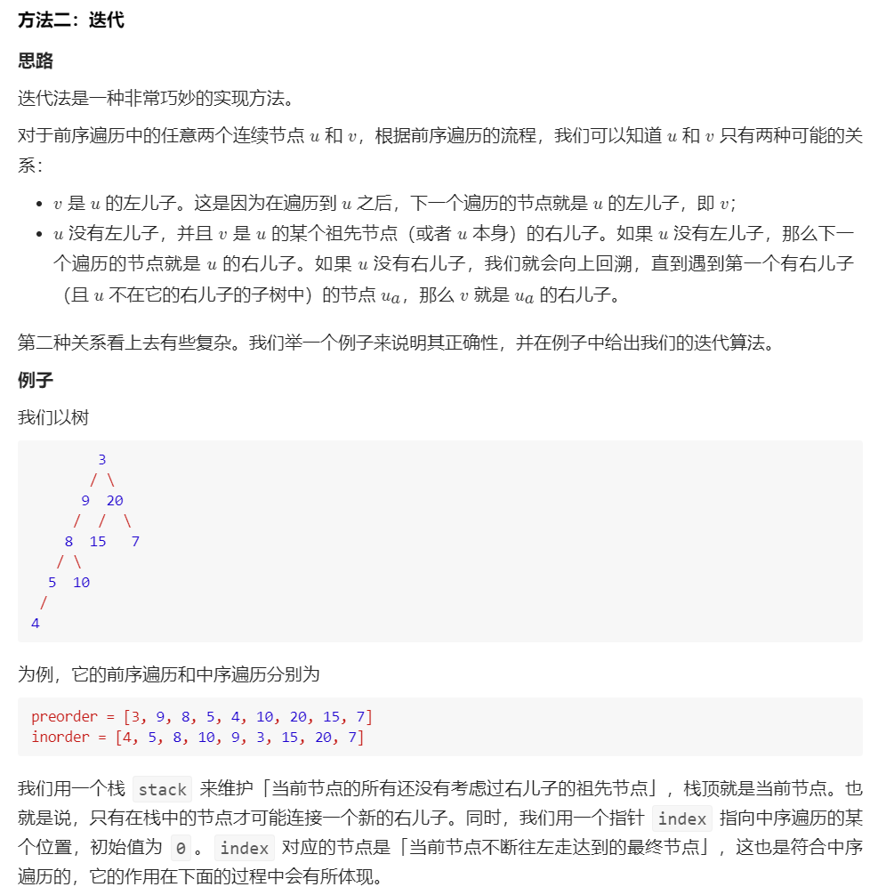
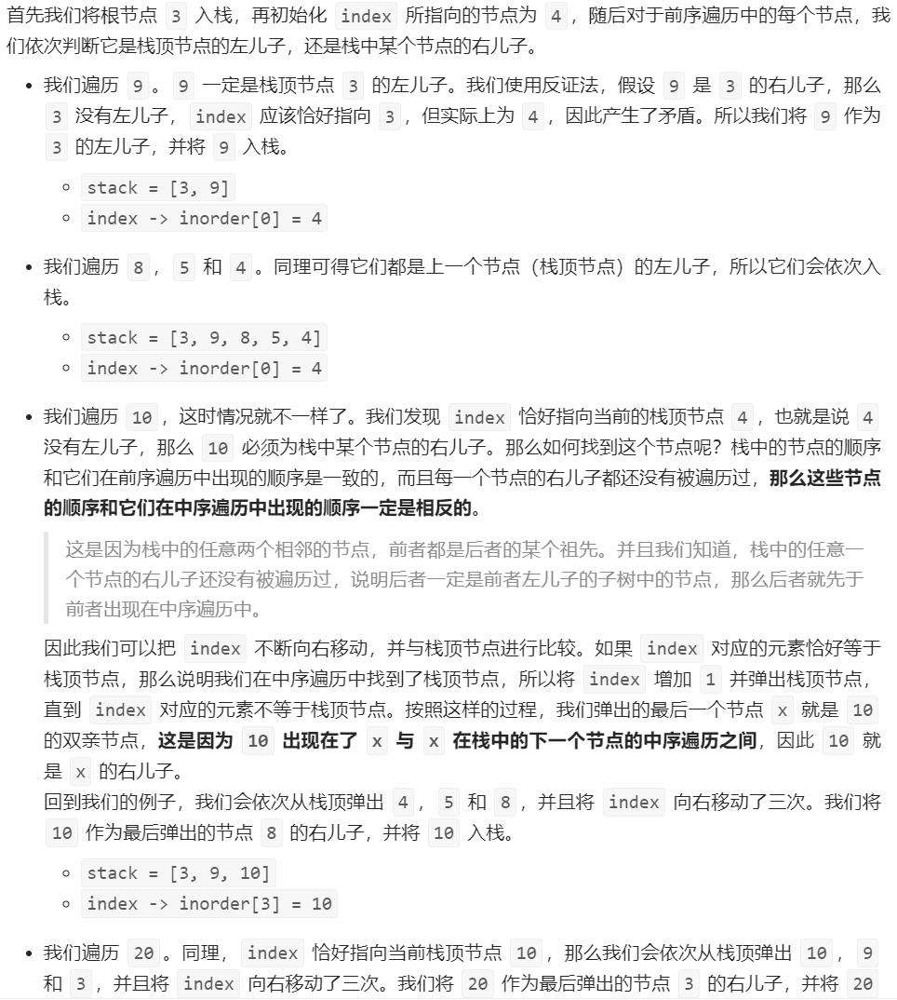
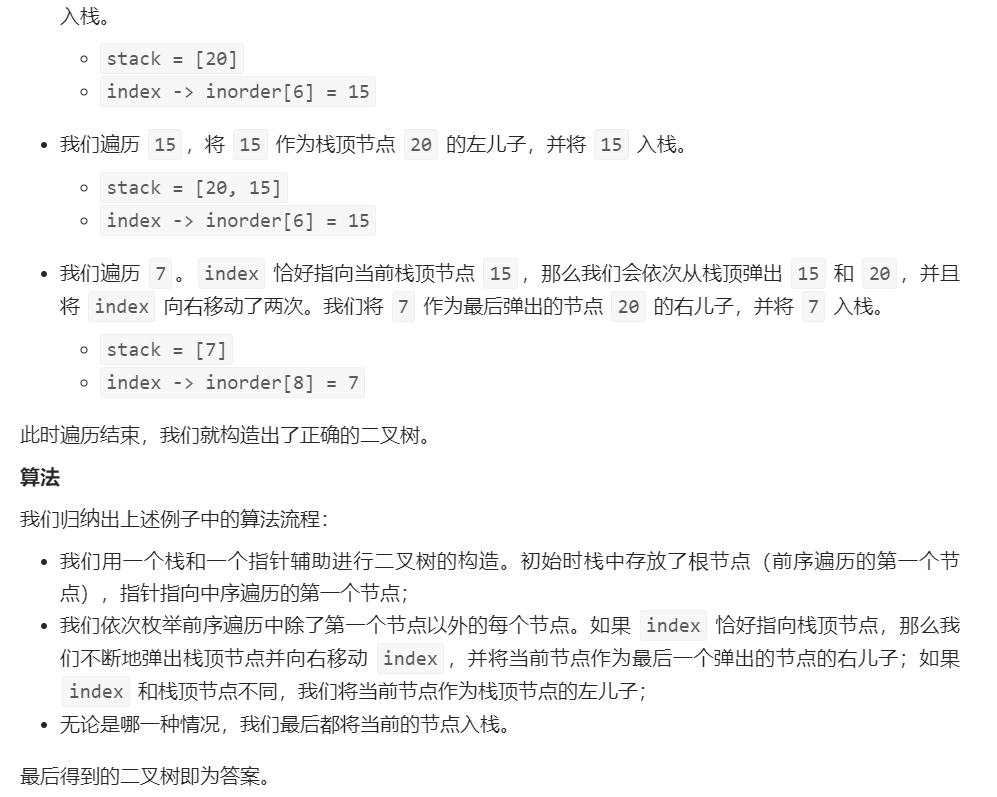

# LeetCode105

[toc]




```java
class Solution {
    private Map<Integer, Integer> indexMap;

    public TreeNode myBuildTree(int[] preorder, int[] inorder, int preorder_left, int preorder_right, int inorder_left, int inorder_right) {
        if (preorder_left > preorder_right) {
            return null;
        }

        // 前序遍历中的第一个节点就是根节点
        int preorder_root = preorder_left;
        // 在中序遍历中定位根节点
        int inorder_root = indexMap.get(preorder[preorder_root]);
        
        // 先把根节点建立出来
        TreeNode root = new TreeNode(preorder[preorder_root]);
        // 得到左子树中的节点数目
        int size_left_subtree = inorder_root - inorder_left;
        // 递归地构造左子树，并连接到根节点
        // 先序遍历中「从 左边界+1 开始的 size_left_subtree」个元素就对应了中序遍历中「从 左边界 开始到 根节点定位-1」的元素
        root.left = myBuildTree(preorder, inorder, preorder_left + 1, preorder_left + size_left_subtree, inorder_left, inorder_root - 1);
        // 递归地构造右子树，并连接到根节点
        // 先序遍历中「从 左边界+1+左子树节点数目 开始到 右边界」的元素就对应了中序遍历中「从 根节点定位+1 到 右边界」的元素
        root.right = myBuildTree(preorder, inorder, preorder_left + size_left_subtree + 1, preorder_right, inorder_root + 1, inorder_right);
        return root;
    }

    public TreeNode buildTree(int[] preorder, int[] inorder) {
        int n = preorder.length;
        // 构造哈希映射，帮助我们快速定位根节点
        indexMap = new HashMap<Integer, Integer>();
        for (int i = 0; i < n; i++) {
            indexMap.put(inorder[i], i);
        }
        return myBuildTree(preorder, inorder, 0, n - 1, 0, n - 1);
    }
}
```








```java
class Solution {
    public TreeNode buildTree(int[] preorder, int[] inorder) {
        if (preorder == null || preorder.length == 0) {
            return null;
        }
        TreeNode root = new TreeNode(preorder[0]);
        Deque<TreeNode> stack = new LinkedList<TreeNode>();
        stack.push(root);
        int inorderIndex = 0;
        for (int i = 1; i < preorder.length; i++) {
            int preorderVal = preorder[i];
            TreeNode node = stack.peek();
            if (node.val != inorder[inorderIndex]) {
                node.left = new TreeNode(preorderVal);
                stack.push(node.left);
            } else {
                while (!stack.isEmpty() && stack.peek().val == inorder[inorderIndex]) {
                    node = stack.pop();
                    inorderIndex++;
                }
                node.right = new TreeNode(preorderVal);
                stack.push(node.right);
            }
        }
        return root;
    }
}
```

```c++
class Solution {
public:
    TreeNode* buildTree(vector<int>& preorder, vector<int>& inorder) {
        if (!preorder.size()) {
            return nullptr;
        }
        TreeNode* root = new TreeNode(preorder[0]);
        stack<TreeNode*> stk;
        stk.push(root);
        int inorderIndex = 0;
        for (int i = 1; i < preorder.size(); ++i) {
            int preorderVal = preorder[i];
            TreeNode* node = stk.top();
            if (node->val != inorder[inorderIndex]) {
                node->left = new TreeNode(preorderVal);
                stk.push(node->left);
            }
            else {
                while (!stk.empty() && stk.top()->val == inorder[inorderIndex]) {
                    node = stk.top();
                    stk.pop();
                    ++inorderIndex;
                }
                node->right = new TreeNode(preorderVal);
                stk.push(node->right);
            }
        }
        return root;
    }
};
```


