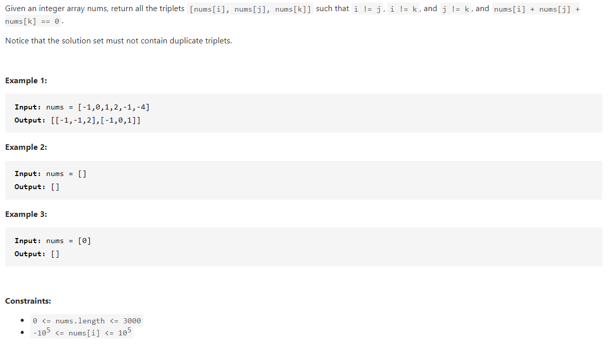

# LeetCode 15 3Sum

## 1. 题目



## 2. 思路


## 3. 代码实现

### 3.1 原始暴力法

#### 3.1.1 思路分析

3Sum问题可以部分转化为2Sum的问题，寻找`a + b + c = 0`的所有解可以转化为寻找`b + c = -a`的问题（2Sum）。那么将`-a`就是2Sum问题中的`target`，即`b + c = target`的2Sum问题。我们将数组`nums`中每个数字作为`target`，然后在其它数字之中寻找`b`和`c`，使得`b + c = target`。为了避免重复查找，我们只对`nums`数组中`target`之后的数字进行查找，一旦找到，就进行判断是否与之前的解重复，重复就丢弃掉，不重复就将`a`，`b`， `c`加入解集合中。最后直到`a`，`b`，`c`对应到数组`nums`最后3位数字后结束查找过程。

**Java**

```java
public class LeetCode_15_3Sum {
    public List<List<Integer>> threeSum(int[] nums) {
        List<List<Integer>> listRes = new ArrayList<>();
        Set<Set<Integer>> setRes = new HashSet<>();
        for (int i = 0; i < nums.length - 2; i++) {
            int target = -nums[i];
            twoSumFromIndex(nums, target, i + 1, nums[i], listRes, setRes);
        }
        return listRes;
    }

    private void twoSumFromIndex(int[] nums, int target, int fromIndex, int startNum,
            List<List<Integer>> listRet, Set<Set<Integer>> setRes) {
        Set<Integer> hashset = new HashSet<>();
        for (int i = fromIndex; i < nums.length; i++) {
            int findNum = target - nums[i];
            List<Integer> listCur = new ArrayList<>();
            Set<Integer> setCur = new HashSet<>();
            if (hashset.contains(findNum)) {
                setCur.add(startNum);
                setCur.add(nums[i]);
                setCur.add(findNum);
                // 检查是否重复
                if (!setRes.contains(setCur)) {
                    setRes.add(setCur);
                    listCur.add(startNum);
                    listCur.add(nums[i]);
                    listCur.add(findNum);
                    listRet.add(listCur);
                }
            }
            hashset.add(nums[i]);
        }
    }
}
```

#### 3.1.2 复杂度分析

这里程序主体是二重循环，时间复杂度为$O(n^2)$​ ；

空间复杂度$O(n)$​；

用该方法在LeetCode中提交会超时。

### 3.2 双指针

#### 3.2.1 思路分析

题目中要求找到所有的“不重复”且和为`0`的三元组，这个不重复的要求使得我们不能简单地使用三重循环枚举所有的三元组，对于，

```java
class Solution {
    public List<List<Integer>> threeSum(int[] nums) {
        int n = nums.length;
        Arrays.sort(nums);
        List<List<Integer>> ans = new ArrayList<List<Integer>>();
        // 枚举 a
        for (int first = 0; first < n; ++first) {
            // 需要和上一次枚举的数不相同
            if (first > 0 && nums[first] == nums[first - 1]) {
                continue;
            }
            // c 对应的指针初始指向数组的最右端
            int third = n - 1;
            int target = -nums[first];
            // 枚举 b
            for (int second = first + 1; second < n; ++second) {
                // 需要和上一次枚举的数不相同
                if (second > first + 1 && nums[second] == nums[second - 1]) {
                    continue;
                }
                // 需要保证 b 的指针在 c 的指针的左侧
                while (second < third && nums[second] + nums[third] > target) {
                    --third;
                }
                // 如果指针重合，随着 b 后续的增加
                // 就不会有满足 a+b+c=0 并且 b<c 的 c 了，可以退出循环
                if (second == third) {
                    break;
                }
                if (nums[second] + nums[third] == target) {
                    List<Integer> list = new ArrayList<Integer>();
                    list.add(nums[first]);
                    list.add(nums[second]);
                    list.add(nums[third]);
                    ans.add(list);
                }
            }
        }
        return ans;
    }
}
```


## 4. 复杂度分析

****

